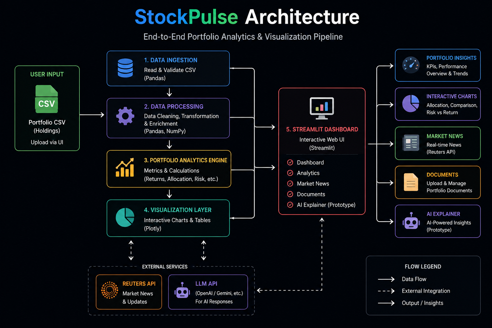
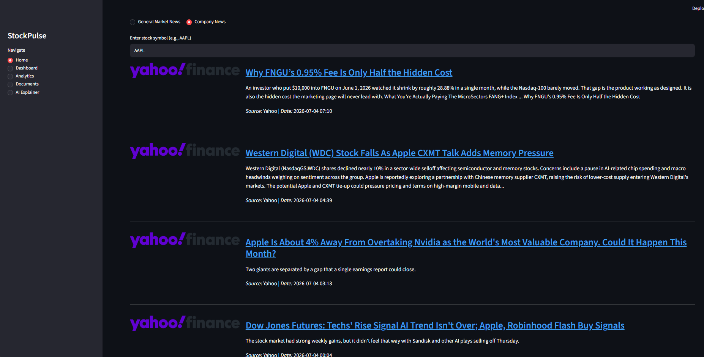
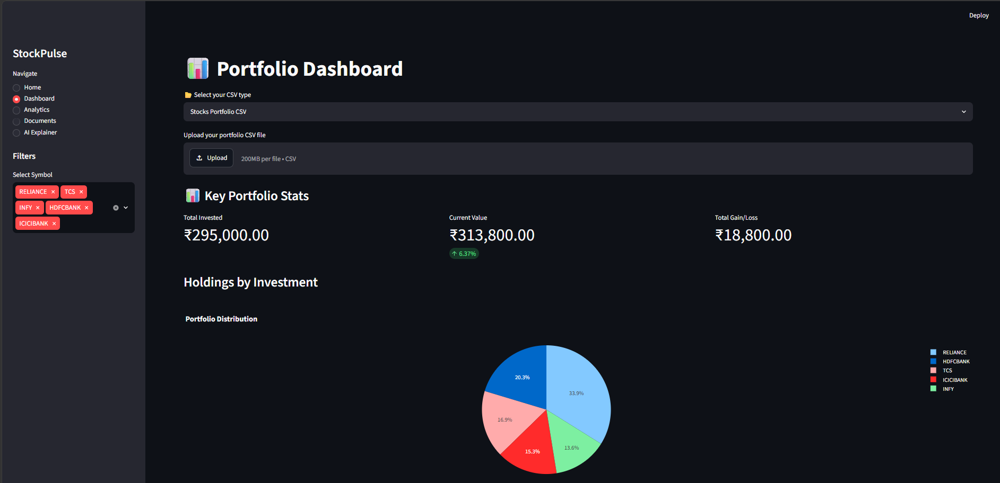
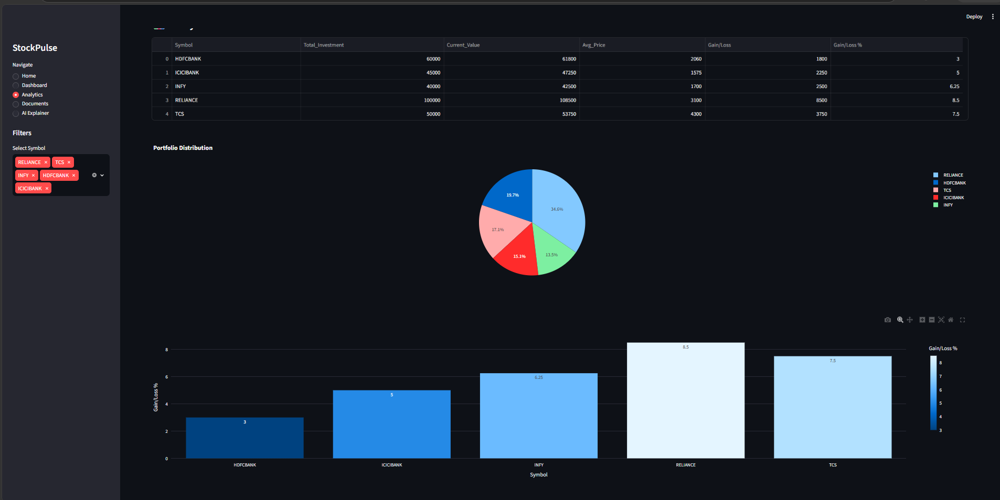
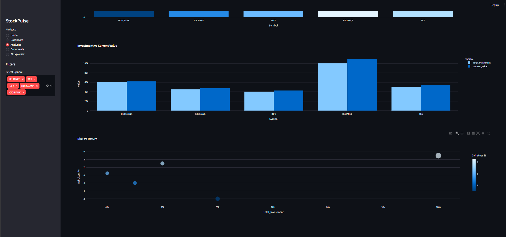
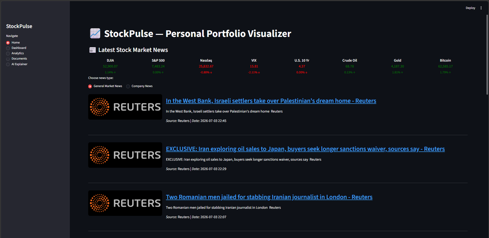
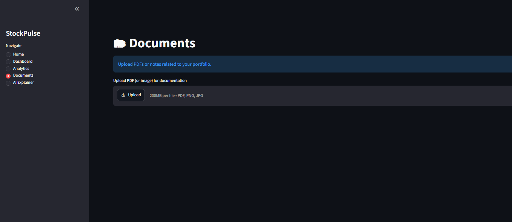
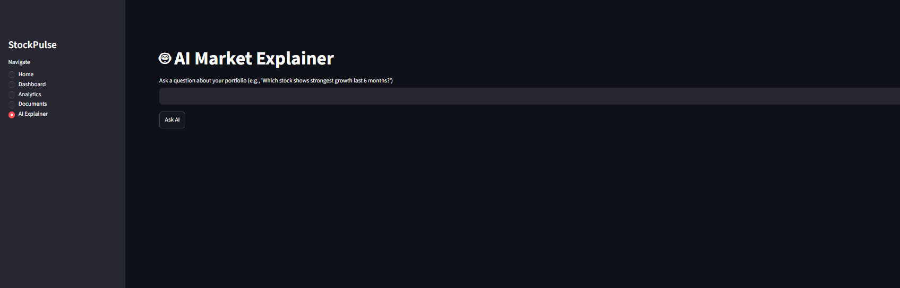

# 📈 StockPulse — AI-Powered Portfolio Analytics Dashboard


StockPulse is an interactive **portfolio analytics dashboard** built with **Python** and **Streamlit** that enables investors to upload stock portfolios, monitor market news, visualize investment performance, analyze portfolio risk, and explore AI-assisted investment insights.

The application combines **financial analytics**, **interactive visualizations**, and **real-time market updates** into a single dashboard to help users better understand their investments and make informed decisions.

---

# 📌 Project Overview

Managing investments across multiple stocks can become difficult without proper visualization and analytics. Investors often rely on spreadsheets that provide raw numbers but lack meaningful insights into portfolio performance.

StockPulse simplifies portfolio analysis by transforming uploaded investment data into interactive dashboards, visual analytics, and portfolio summaries. The application also integrates market news and includes a prototype AI assistant for future intelligent investment guidance.

The project demonstrates practical skills in:

- Data Analysis
- Financial Analytics
- Interactive Dashboard Development
- Portfolio Visualization
- API Integration
- Streamlit Development
- Business Intelligence

---

# 🎯 Business Problem

Retail investors often struggle to understand:

- Overall portfolio performance
- Asset allocation
- Portfolio diversification
- Profit and loss distribution
- Market events affecting investments
- Risk versus return across holdings

Traditional spreadsheets provide limited insights and require manual calculations.

StockPulse addresses these challenges by providing an interactive analytics platform that automatically processes portfolio data and presents actionable visual insights.

---

# 💡 Solution

StockPulse provides an end-to-end investment analytics workflow that enables users to:

- Upload stock portfolio CSV files
- Calculate investment metrics
- Monitor current portfolio value
- Visualize allocation using interactive charts
- Compare investments across stocks
- Analyze portfolio performance
- Read real-time financial news
- Store portfolio-related documents
- Explore future AI-powered investment assistance

---

# ✨ Features

- 📊 Interactive Portfolio Dashboard
- 📈 Investment Performance Analytics
- 📉 Risk vs Return Analysis
- 🥧 Portfolio Allocation Charts
- 📰 Real-Time Financial News
- 📂 Portfolio Document Management
- 🤖 AI Market Explainer (Prototype)
- 📁 CSV Portfolio Upload
- 🌙 Modern Dark Dashboard UI

---

# 🏗 System Architecture

The application follows a modular architecture that separates data ingestion, portfolio analytics, visualization, and user interaction. Portfolio data is processed using Pandas and NumPy before being visualized through interactive Plotly charts within a Streamlit dashboard. External APIs provide live market news, while the AI Market Explainer is designed as a future enhancement for intelligent investment insights.

<p align="center">
  
</p>

---

# 📷 Application Preview

## 🏠 Home Page

The landing page displays live market indices, financial news, and allows users to switch between general market news and company-specific news.

<p align="center">
  
</p>

---

## 📊 Portfolio Dashboard

Upload a portfolio CSV to instantly calculate key investment metrics including total investment, current value, overall gain/loss, and portfolio allocation.

<p align="center">
  
</p>

---

## 📈 Portfolio Analytics

Analyze portfolio holdings through interactive tables and summary statistics.

<p align="center">
  
</p>

---

## 📉 Investment Analysis

Interactive charts help investors compare portfolio performance using:

- Portfolio Distribution
- Gain/Loss Percentage
- Investment vs Current Value
- Risk vs Return

<p align="center">
  
</p>

---

## 📰 Company News

Retrieve company-specific financial news by entering a stock ticker symbol.

<p align="center">
  
</p>

---

## 📂 Portfolio Documents

Upload supporting investment documents such as PDFs, notes, and reports for centralized portfolio management.

<p align="center">
  
</p>

---

## 🤖 AI Market Explainer (Prototype)

The project includes a prototype interface for future AI-powered investment insights. This feature is currently under development and serves as a placeholder for upcoming integration with Large Language Models (LLMs).

<p align="center">
  
</p>

---

# 💻 Technology Stack

| Category | Technologies |
|-----------|--------------|
| Programming Language | Python 3.x |
| Dashboard Framework | Streamlit |
| Data Processing | Pandas, NumPy |
| Data Visualization | Plotly |
| Financial News | Reuters API / Yahoo Finance |
| File Handling | CSV, PDF |
| Development Environment | VS Code |
| Version Control | Git & GitHub |

---

# 📂 Repository Structure

```text
StockPulse/
│
├── visuals/
│   ├── Stockpulse_architecture.png
│   ├── market-news.png
│   ├── portfolio-dashboard.png
│   ├── portfolio-analytics.png
│   ├── risk-return-analysis.png
│   ├── company-news.png
│   ├── documents-page.png
│   └── ai-explainer.png
│
├── modules/
│
├── public/
│
├── src/
│
├── app.py
├── requirements.txt
├── README.md
├── package.json
├── package-lock.json
├── tailwind.config.js
├── postcss.config.js
└── .gitignore
```

---

# 🚀 Getting Started

## Prerequisites

Install the required Python packages.

```bash
pip install -r requirements.txt
```

---

## Clone Repository

```bash
git clone https://github.com/rudrasave/StockPulse.git

cd StockPulse
```

---

## Run the Application

Launch the Streamlit application:

```bash
streamlit run app.py
```

After the application starts, open your browser and visit:

```text
http://localhost:8501
```

---

# 📊 Dashboard Modules

| Module | Description |
|---------|-------------|
| 🏠 Home | Live market indices and financial news |
| 📊 Dashboard | Portfolio KPIs and investment summary |
| 📈 Analytics | Portfolio performance analysis |
| 📉 Charts | Interactive investment visualizations |
| 📂 Documents | Upload portfolio-related documents |
| 🤖 AI Explainer | Prototype interface for future AI integration |

---

# 🎯 Key Highlights

✔ Interactive Streamlit Dashboard

✔ Portfolio Performance Analytics

✔ Real-Time Financial News

✔ Interactive Plotly Visualizations

✔ Portfolio Allocation Analysis

✔ Risk vs Return Insights

✔ CSV Portfolio Upload

✔ Modular Python Codebase

✔ Responsive Dark Theme UI

✔ AI Assistant Prototype

---

# 🔮 Future Improvements

Planned enhancements include:

- 🔄 Live stock price integration
- 📈 Portfolio performance forecasting
- 🤖 AI-powered investment recommendations
- 📊 Risk scoring and portfolio optimization
- 📄 Automated PDF report generation
- 👤 User authentication
- ☁ Cloud deployment using AWS or Azure
- 🐳 Docker containerization
- 📱 Mobile-responsive dashboard

---

# 📜 License

This project is licensed under the **MIT License**.

---

# 👨‍💻 Author

**Rudra Save**

📧 Email: **rudrasave1709@gmail.com**

🔗 LinkedIn

https://www.linkedin.com/in/rudra-save-a90749358/

💻 GitHub

https://github.com/rudrasave

---

# ⭐ Support

If you found this project helpful, consider giving it a ⭐ **Star** on GitHub.

Your support helps others discover the project and motivates future open-source development.

